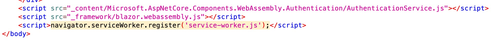

# Penetration Test ZAP (Zed Attack Proxy)

## Vulnerabilities

1. No Anti-CSRF tokens were found in a HTML submission form
    - A cross-site request forgery is an attack that involves forcing a victim to send an HTTP request to a target destination without their knowledge or intent in order to perform an action as the victim.
    - Solution: Use a vetted library or framework that does not allow this weakness to occur or provides constructs that make this weakness easier to avoid.
    - <https://blog.insiderattack.net/anti-csrf-tokens-to-prevent-cross-site-request-forgery-csrf-79b9d7a5c079>

2. Passive (90022 - Application Error Disclosure)
   - This page contains an error/warning message that may disclose sensitive information like the location of the file that produced the unhandled exception. This information can be used to launch further attacks against the web application.
   - Solution: Review the source code of this page. Implement a custom error page!

3. Content Security Policy (CSP) Header Not Set
   - Content Security Policy (CSP) is an added layer of security that helps to detect and mitigate certain types of attacks, including Cross Site Scripting (XSS) and data injection attacks.
   - Solution:  Ensure that your web server, application server, load balancer, etc. is configured to set the Content-Security-Policy header.
   - <https://content-security-policy.com/examples/nginx/>

4. Hidden File Found
   - A sensitive file was identified as accessible or available. This may leak administrative, configuration, or credential information which can be leveraged by a malicious individual to further attack the system or conduct social engineering efforts.
   - Screenshot found in our index.html exposes Client/wwwroot/service-worker 

5. Vulnerable JS Library
   - jQuery Validation Plugin v1.17.0 is vulnerable.
   - URL: <http://souffle.nu/Identity/lib/jquery-validation/dist/jquery.validate.js>
   - Solution: Please upgrade to the latest version of jQuery-validation.

6. XSLT Injection might be possible.
   - Injection using XSL transformations may be possible, and may allow an attacker to read system information, read and write files, or execute arbitrary code.
   - Solution: Sanitize and analyze every user input coming from any client-side
   - Article: <https://blog.pentesteracademy.com/xslt-injections-for-dummies-a0cfbe0c42f5>
